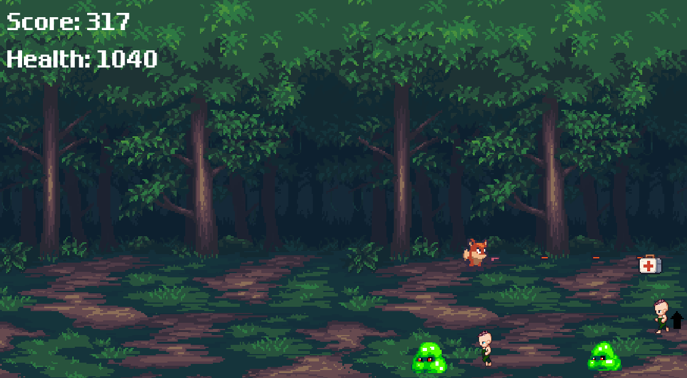
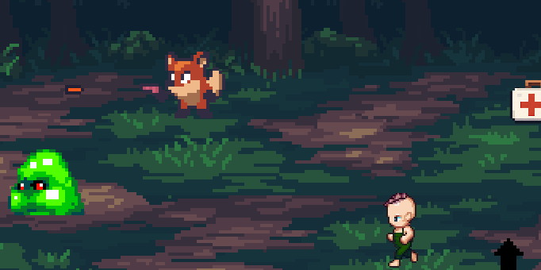

# 🦊 Fox Game
[🇺🇸 English](README.md) | [🇨🇳 中文](README.cn.md) | [tc 繁中](README.tc.md)

一款使用 **Godot 引擎** 制作的像素风格 2D 动作游戏。

- [原始教程链接](https://merxon22.github.io/GodotArchive/zh/posts/beginner_2d/)
- 本项目基于初学者 2D 教程，并进行了**模块化设计与功能拓展**。

---

## 🔧 相比原始教程的扩展内容

本项目对原始教程内容进行了以下重要增强：

### 1. 🧩 基于 Signal 的架构设计
- 使用 **signal（信号）** 替代直接函数调用，实现节点之间的解耦通信。
- 子节点（如玩家、敌人、道具）通过 signal 向上通知父节点（如 GameManager 或 UI）执行操作，提高可维护性和扩展性。

### 2. ❤️ 玩家与敌人生命值系统
- 增加了 **玩家和敌人的血量机制**。
- 玩家血量归零时播放死亡动画，并重载当前场景。
- 不同强度的敌人需要多次攻击才能击败。

### 3. 👹 多种敌人类型
- 实现了 **多种敌人变体**，具备：
  - 不同的移动速度与生命值。
  - 碰撞时造成不同的伤害。
  - 强敌被击败时掉落更高价值的道具。

### 4. 🎁 道具系统

- 新增两类可拾取道具：
  - **医疗包（Medkit）**：恢复玩家生命值。
  - **强化器（Speeder）**：暂时提高玩家的攻击速度。
- 所有道具均为独立 `Area2D` 节点，通过 signal 控制使用逻辑。

### 5. 🖼️ UI 独立为子场景
- 所有用户界面元素（得分显示、生命值、游戏结束提示）被放置在一个独立的 **UI 场景**（`CanvasLayer`）中。
- UI 的更新通过接收来自玩家或 GameManager 的 signal 实现。

---

## 🚀 快速开始

1. 使用 Godot 4.x 打开项目。
2. 运行 `Main.tscn` 场景即可开始游戏。

---

## 🧪 致谢

- 教程来源：[merxon22](https://merxon22.github.io/GodotArchive/zh/posts/beginner_2d/)
- 精灵图与像素素材由 ChatGPT 的图像生成工具协助制作。
