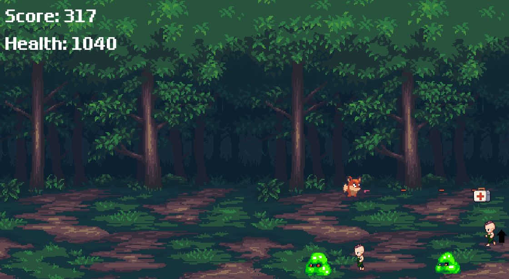
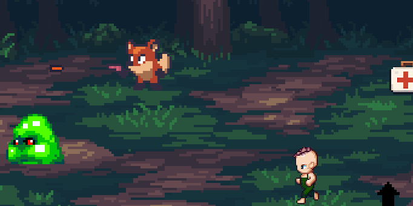

# 🦊 Fox Game
[🇺🇸 English](README.md) | [🇨🇳 中文](README.cn.md) | [tc 繁中](README.tc.md)

一款以 **Godot Engine** 製作的像素風 2D 動作遊戲。

- [原始教學來源](https://merxon22.github.io/GodotArchive/zh/posts/beginner_2d/)
- 本專案以入門教學為基礎，並透過模組化設計與新增機制進行了**功能擴展與重構**。
- [Play!](https://yizi-yiezi.itch.io/fox-game)

---

## 🔧 相較原始教學的擴充項目

本專案針對原始教學內容進行以下主要強化：

### 1. 🧩 基於 Signal 的架構
- 以 **signal（訊號）** 取代直接呼叫函式，用來實現低耦合的節點間通訊。
- 子節點（如玩家、敵人、道具）透過 signal 通知父節點（如 GameManager、UI）執行對應行為，提升可維護性與擴展性。

### 2. ❤️ 玩家與敵人的血量系統
- 為玩家與敵人新增了 **血量機制**。
- 玩家血量歸零時會觸發死亡動畫並重新載入場景。
- 敵人根據強度需多次攻擊才能擊敗。

### 3. 👹 敵人類型多樣化
- 增加了 **多種敵人類型**，包含：
  - 不同速度與血量。
  - 遭遇時造成不同的傷害值。
  - 較強敵人擊敗後會掉落更多有價值的道具。

### 4. 🎁 道具系統

- 新增兩種可收集道具：
  - **醫療包（Medkit）**：可恢復玩家血量。
  - **強化器（Speeder）**：暫時提升玩家的攻擊速度。
- 每個道具為獨立的 `Area2D` 節點，使用 signal 觸發使用行為。

### 5. 🖼️ UI 獨立為專屬場景
- 所有 UI 元素（分數、血條、Game Over 標籤）皆獨立設計在 **專屬 UI 場景**（`CanvasLayer`）中。
- UI 的更新透過 signal 從玩家或 GameManager 接收事件，強化模組分離。

### 6. 全螢幕切換
- 遊戲中按下 F11 可在視窗模式與全螢幕模式間切換。

---

## 🚀 快速開始

1. 使用 Godot 4.x 打開本專案。
2. 執行 `Main.tscn` 場景即可開始遊戲。

---

## 🧪 致謝

- 教學來源：[merxon22](https://merxon22.github.io/GodotArchive/zh/posts/beginner_2d/)
- 像素圖資由 ChatGPT 的圖像生成工具協助製作。
